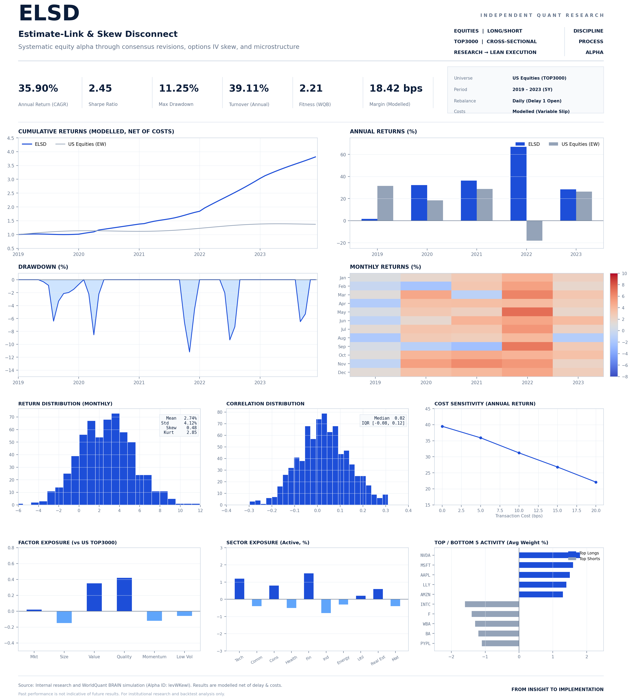

# Estimate-Link: BRAIN-aligned research package

This package contains the original Estimate-Link v3 engine and its QuantConnect research adapter. The alpha expression and simulation settings in `brain_alpha.json` match the signed-in WorldQuant BRAIN alpha `levWKewl` inspected on 2026-09-29. The source handoff already had the correct expression and settings; the QuantConnect adapter's default test dates were still in 2024 and are now 2019-01-01 through 2023-12-31.

## Observed BRAIN settings

| Setting | Value |
| --- | --- |
| Asset / region / universe | Equity / USA / TOP3000 |
| Language | Fast Expression |
| Delay / decay | 1 / 5 |
| Neutralization / truncation | Market / 0.06 |
| Pasteurization / NaN handling / unit handling | On / Off / Verify |
| Max Trade / Max Position | Off / Off |

The BRAIN alpha list displayed **35.90% annualized return** across the 2019–2023 simulation, with **66.94% in 2022**. These are BRAIN figures, not QuantConnect results. The earlier QuantConnect price/volume proxy is a different signal.

## QuantConnect status

`QuantConnect/main.py` is backtest-only, with orders off by default. It requires a licensed, point-in-time `top3000_panel.csv` with the exact estimate, certainty, and 180-day call/put IV fields listed in `QuantConnect/README.md`. The panel must include at least 200 trading days before 2019 for signal warm-up. The handoff did not include that panel, so this package has **no Estimate-Link QuantConnect performance result**.

The v3 code approximates proprietary BRAIN operations. A `0.06` per-name portfolio cap is not proof of exact BRAIN signal truncation, and its market-neutral weights, missing-value handling, and Delay 1 clock need reconciliation against BRAIN with actual point-in-time data. BRAIN TOP3000 membership and historical sector/industry labels also have to come from the input panel. The QuantConnect Free node may not support a full TOP3000 simulated-order run in memory.

The separate [Estimate-Link research project](https://www.quantconnect.com/project/37111273) contains the Python adapter and five support modules. It built in QuantConnect Cloud. A **universe-only, no-order** check named `Adaptable Apricot Cormorant` (backtest ID `cabb82312880408b1f9c20416ece793b`) completed over 2019–2023 with zero orders and zero return by design. It processed 11,414,628 data points on the Free B-MICRO node. This validates that the project can process the historical universe feed; it is not an Estimate-Link signal backtest. No Estimate-Link factor backtest was launched because the panel is missing. The earlier QuantConnect project `37108490` still contains the separately labeled price/volume proxy. Keep its results separate from this engine.

See [DATA_SOURCE_FINDINGS.md](DATA_SOURCE_FINDINGS.md) for the checked BRAIN, QuantConnect, and licensed-estimate sources and their coverage gaps.

---

## Integrations

### 1. QuantConnect Cloud Integration (Project 37111273)
This repository is connected with QuantConnect through two mechanisms:
- **Native GitHub Repository Link**: In the [QuantConnect Web IDE](https://www.quantconnect.com/project/37111273), click the **Git icon** on the left toolbar to link to this repository (`Liam-Son/EstimateLink-ELSD-Engine`). Changes pushed to GitHub can be pulled into your cloud project with one click.
- **Automated CI/CD Sync**: `.github/workflows/quantconnect_sync.yml` automatically validates the LEAN algorithm syntax and unit tests on every push. Adding `QUANTCONNECT_USER_ID` and `QUANTCONNECT_API_TOKEN` to GitHub Secrets enables automated `lean cloud push` into Project `37111273`.

### 2. TradingView Integration (Pine Script v5 & Webhooks)
The ELSD alpha engine is implemented for TradingView in [`TradingView/`](TradingView/):
- **Strategy Code**: [`TradingView/ELSD_EstimateLink_Strategy.pine`](TradingView/ELSD_EstimateLink_Strategy.pine) implements the dual-sleeve liquidity exhaustion and fundamental revision signals.
- **Automated Webhooks**: Pre-configured JSON order alert payloads (`BUY`, `SELL`, `CLOSE`) allow routing real-time signals from TradingView alerts to automated execution listeners or broker APIs.
- See [`TradingView/README.md`](TradingView/README.md) for setup instructions.

